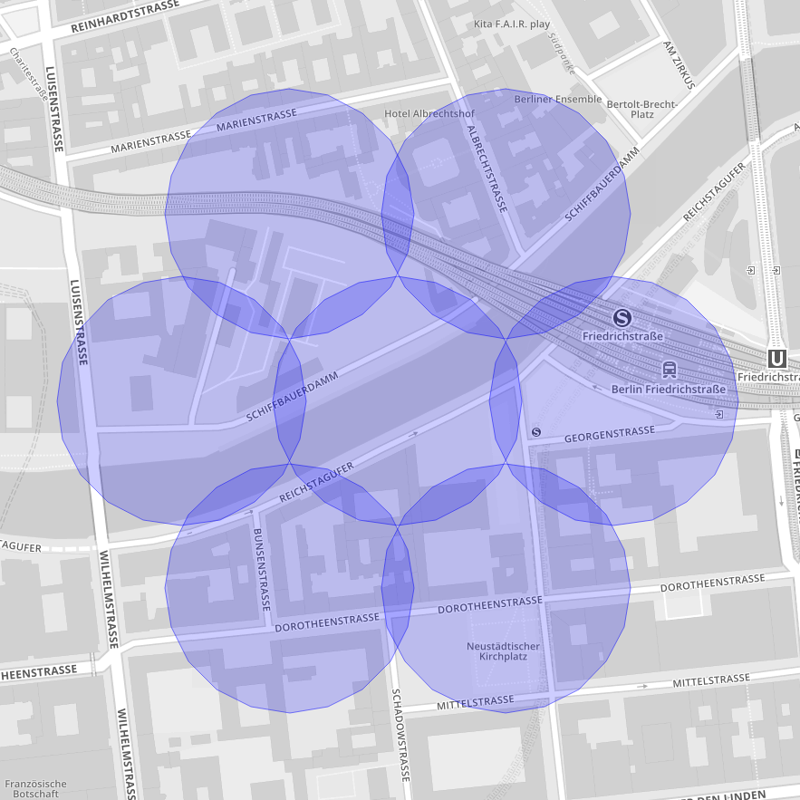
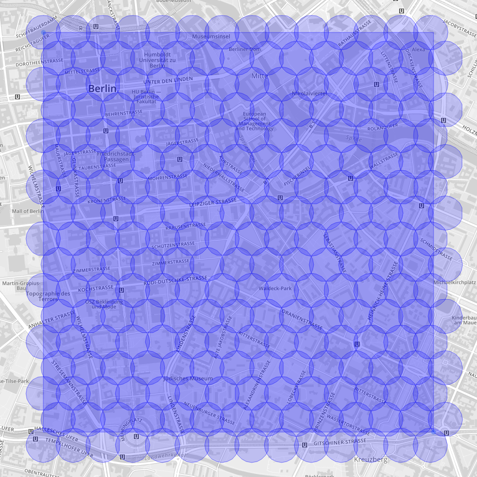
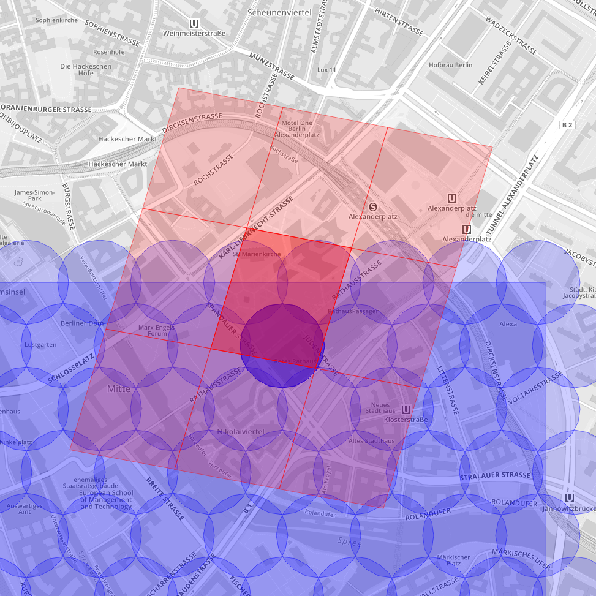

# geoscrape

Some tools for dividing a map into smaller areas.

## Dependencies

* python-s2sphere
* python-numpy

## Examples

You can paste the example outputs into http://s2map.com or https://github.com/spezifisch/s2map

These are some randomly chosen points and areas.

### Hexagon neighbors

```
Hexagon neighbors of: (52.519957,13.383781)
->
[(52.519957,13.383781), (52.5213060031,13.3850609974), (52.519957,13.3863409162), (52.5186080383,13.3850609188), (52.5186080383,13.3825010812), (52.519957,13.3812210838), (52.5213060031,13.3825010026)]
```



### Divide rectangle into hexagons

```
Corner locations for rectangle [(52.519957,13.383781), (52.499068,13.417307)]
->
[(52.519957,13.383781), (52.519957,13.3863409162), (52.519957,13.3889008323), (52.519957,13.3914607483), (52.519957,13.3940206645), (52.519957,13.3965805801), (52.519957,13.3991404963), (52.519957,13.4017004124), (52.519957,13.4042603284), (52.5199525462,13.4068202458), (52.5199525462,13.4093801604), (52.5199525462,13.4119400777), (52.5199525462,13.4144999921), (52.5199525462,13.4170599065), (52.5186080383,13.3850609188), (52.5186080383,13.3876207563), (52.5186080383,13.3901805939), (52.5186080383,13.3927404313), (52.5186080383,13.3953002689), (52.5186080383,13.3978601059), (52.5186080383,13.4004199434), (52.5186080383,13.402979781), (52.5186080383,13.4055396184), (52.5186035847,13.4080994571), (52.5186035847,13.4106592932), (52.5186035847,13.4132191319), (52.5186035847,13.4157789677), (52.5186035847,13.4183388035), (52.5172591181,13.383781), (52.5172591181,13.386340759), (52.5172591181,13.3889005179), (52.5172591181,13.3914602767), (52.5172591181,13.3940200358), (52.5172591181,13.3965797941), (52.5172591181,13.3991395531), (52.5172591181,13.4016993121), (52.5172591181,13.4042590709), (52.5172546647,13.4068188311), (52.5172546647,13.4093785885), (52.5172546647,13.4119383486), (52.5172546647,13.4144981059), (52.5172546647,13.417057863), (52.5159101564,13.3850609188), (52.5159101564,13.3876205992), (52.5159101564,13.3901802795), (52.5159101564,13.3927399597), (52.5159101564,13.3952996402), (52.5159101564,13.39785932), (52.5159101564,13.4004190004), (52.5159101564,13.4029786807), (52.5159101564,13.405538361), (52.5159057032,13.4080980426), (52.5159057032,13.4106577214), (52.5159057032,13.4132174029), (52.5159057032,13.4157770816), (52.5159057032,13.4183367602), (52.5145614018,13.383781), (52.5145614018,13.3863406018), (52.5145614018,13.3889002036), (52.5145614018,13.3914598052), (52.5145614018,13.3940194072), (52.5145614018,13.3965790084), (52.5145614018,13.3991386102), (52.5145614018,13.401698212), (52.5145614018,13.4042578137), (52.5145569489,13.4068174167), (52.5145569489,13.409377017), (52.5145569489,13.4119366199), (52.5145569489,13.41449622), (52.5145569489,13.41705582), (52.5132124401,13.3850609188), (52.5132124401,13.387620442), (52.5132124401,13.3901799653), (52.5132124401,13.3927394883), (52.5132124401,13.3952990116), (52.5132124401,13.3978585343), (52.5132124401,13.4004180575), (52.5132124401,13.4029775807), (52.5132124401,13.4055371039), (52.5132079873,13.4080966283), (52.5132079873,13.41065615), (52.5132079873,13.4132156744), (52.5132079873,13.4157751959), (52.5132079873,13.4183347173), (52.5118638512,13.383781), (52.5118638512,13.3863404447), (52.5118638512,13.3888998894), (52.5118638512,13.3914593339), (52.5118638512,13.3940187787), (52.5118638512,13.3965782228), (52.5118638512,13.3991376675), (52.5118638512,13.4016971121), (52.5118638512,13.4042565567), (52.5118593986,13.4068160026), (52.5118593986,13.4093754458), (52.5118593986,13.4119348916), (52.5118593986,13.4144943346), (52.5118593986,13.4170537774), (52.5105148894,13.3850609188), (52.5105148894,13.3876202849), (52.5105148894,13.390179651), (52.5105148894,13.392739017), (52.5105148894,13.3952983832), (52.5105148894,13.3978577487), (52.5105148894,13.4004171149), (52.5105148894,13.402976481), (52.5105148894,13.405535847), (52.5105104371,13.4080952143), (52.5105104371,13.4106545789), (52.5105104371,13.4132139462), (52.5105104371,13.4157733106), (52.5105104371,13.4183326749), (52.5091664661,13.383781), (52.5091664661,13.3863402876), (52.5091664661,13.3888995752), (52.5091664661,13.3914588626), (52.5091664661,13.3940181503), (52.5091664661,13.3965774373), (52.5091664661,13.399136725), (52.5091664661,13.4016960125), (52.5091664661,13.4042553), (52.509162014,13.4068145888), (52.509162014,13.4093738749), (52.509162014,13.4119331636), (52.509162014,13.4144924495), (52.509162014,13.4170517353), (52.5078175043,13.3850609188), (52.5078175043,13.3876201278), (52.5078175043,13.3901793369), (52.5078175043,13.3927385457), (52.5078175043,13.3952977549), (52.5078175043,13.3978569634), (52.5078175043,13.4004161724), (52.5078175043,13.4029753815), (52.5078175043,13.4055345904), (52.5078130524,13.4080938006), (52.5078130524,13.4106530082), (52.5078130524,13.4132122184), (52.5078130524,13.4157714257), (52.5078130524,13.4183306329), (52.5064692466,13.383781), (52.5064692466,13.3863401306), (52.5064692466,13.3888992611), (52.5064692466,13.3914583915), (52.5064692466,13.3940175221), (52.5064692466,13.3965766521), (52.5064692466,13.3991357826), (52.5064692466,13.4016949132), (52.5064692466,13.4042540436), (52.5064647949,13.4068131753), (52.5064647949,13.4093723044), (52.5064647949,13.4119314361), (52.5064647949,13.4144905649), (52.5064647949,13.4170496936), (52.5051202848,13.3850609188), (52.5051202848,13.3876199708), (52.5051202848,13.3901790228), (52.5051202848,13.3927380746), (52.5051202848,13.3952971268), (52.5051202848,13.3978561782), (52.5051202848,13.4004152302), (52.5051202848,13.4029742822), (52.5051202848,13.4055333341), (52.5051158333,13.4080923873), (52.5051158333,13.4106514378), (52.5051158333,13.413210491), (52.5051158333,13.4157695413), (52.5051158333,13.4183285914), (52.5037677403,13.383781), (52.5037677403,13.3863399733), (52.5037677403,13.3888989466), (52.5037677403,13.3914579196), (52.5037677403,13.394016893), (52.5037677403,13.3965758657), (52.5037677403,13.399134839), (52.5037677403,13.4016938122), (52.5037677403,13.4042527854), (52.5037632891,13.4068117599), (52.5037632891,13.4093707316), (52.5037632891,13.411929706), (52.5037632891,13.4144886776), (52.5037632891,13.417047649), (52.5024187787,13.3850609188), (52.5024187787,13.3876198135), (52.5024187787,13.3901787083), (52.5024187787,13.3927376028), (52.5024187787,13.3952964977), (52.5024187787,13.3978553918), (52.5024187787,13.4004142866), (52.5024187787,13.4029731813), (52.5024187787,13.405532076), (52.5024143277,13.4080909719), (52.5024143277,13.4106498652), (52.5024143277,13.4132087611), (52.5024143277,13.4157676541), (52.5024143277,13.418326547), (52.5010708521,13.383781), (52.5010708521,13.3863398163), (52.5010708521,13.3888986326), (52.5010708521,13.3914574487), (52.5010708521,13.3940162651), (52.5010708521,13.3965750808), (52.5010708521,13.3991338971), (52.5010708521,13.4016927134), (52.5010708521,13.4042515295), (52.5010664012,13.406810347), (52.5010664012,13.4093691618), (52.5010664012,13.4119279792), (52.5010664012,13.4144867938), (52.5010664012,13.4170456083), (52.4997218904,13.3850609188), (52.4997218904,13.3876196566), (52.4997218904,13.3901783943), (52.4997218904,13.3927371319), (52.4997218904,13.3952958698), (52.4997218904,13.397854607), (52.4997218904,13.4004133448), (52.4997218904,13.4029720826), (52.4997218904,13.4055308202), (52.4997174398,13.4080895592), (52.4997174398,13.4106482955), (52.4997174398,13.4132070344), (52.4997174398,13.4157657705), (52.4997174398,13.4183245064), (52.4983741292,13.383781), (52.4983741292,13.3863396594), (52.4983741292,13.3888983187), (52.4983741292,13.3914569778), (52.4983741292,13.3940156373), (52.4983741292,13.396574296), (52.4983741292,13.3991329554), (52.4983741292,13.4016916147), (52.4983741292,13.404250274), (52.4983696788,13.4068089345), (52.4983696788,13.4093675923), (52.4983696788,13.4119262528), (52.4983696788,13.4144849104), (52.4983696788,13.417043568)]
```



### S2 cell neighbors

Here the center of the dark blue cell with 100 m diameter is our location. The darker red trapezoid is the level 15 S2 cell which contains it.
The other red trapezoids are the immediate neighbors with connecting edges. The trapezoids contain the complete area of the blue cell in all cases.
This is not necessarily the case when walking the S2 cell neighborhood by iterating over the Hilbert curve by id.

```
S2 cell edge neighbors for (52.5186035847,13.4080994571)
->
Level 15 cell id: 5163462873199935488
Neighborhood (edges):
[5163462873199935488, 5163462879642386432, 5163466994221056000, 5163462875347419136, 5163462871052451840, 5163462877494902784, 5163462868904968192, 5163466992073572352, 5163466996368539648]
Neighborhood (ids):
[5163462851725099008, 5163462853872582656, 5163462856020066304, 5163462858167549952, 5163462860315033600, 5163462862462517248, 5163462864610000896, 5163462866757484544, 5163462868904968192, 5163462871052451840, 5163462873199935488, 5163462875347419136, 5163462877494902784, 5163462879642386432, 5163462881789870080, 5163462883937353728, 5163462886084837376, 5163462888232321024, 5163462890379804672, 5163462892527288320, 5163462894674771968]
```



